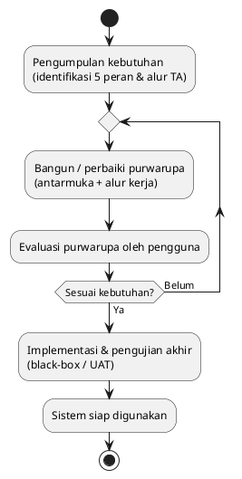
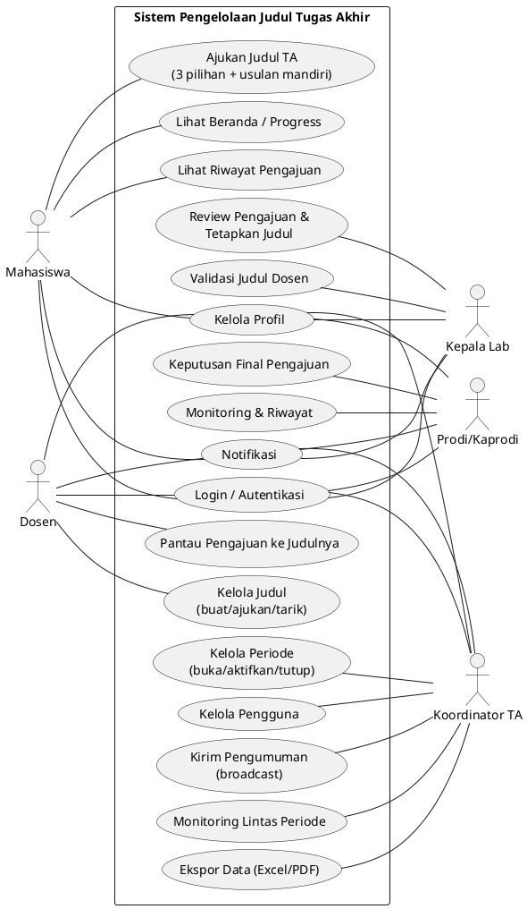
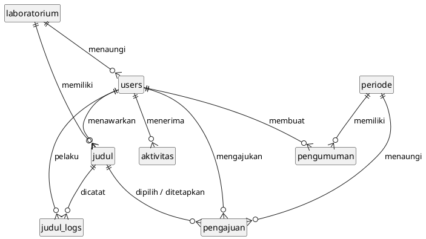
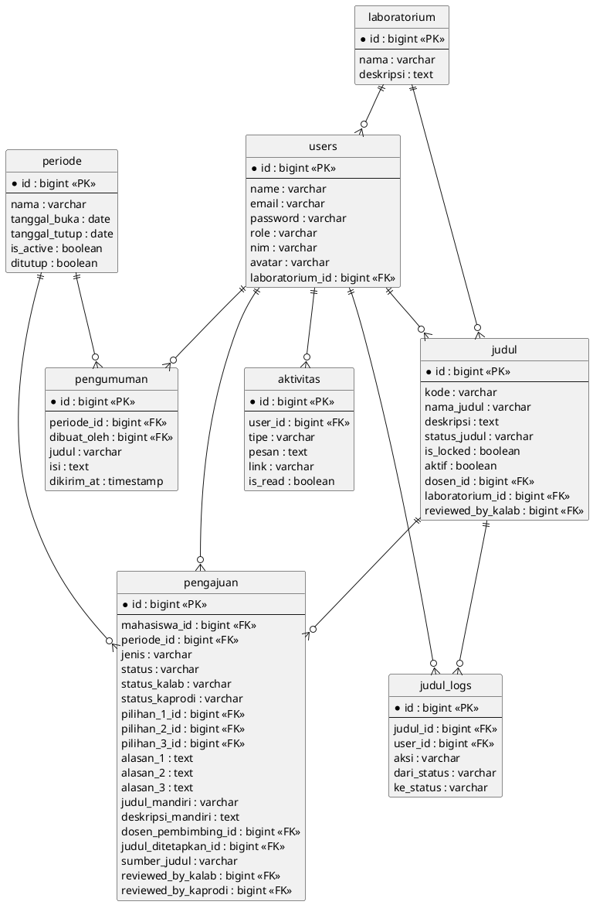
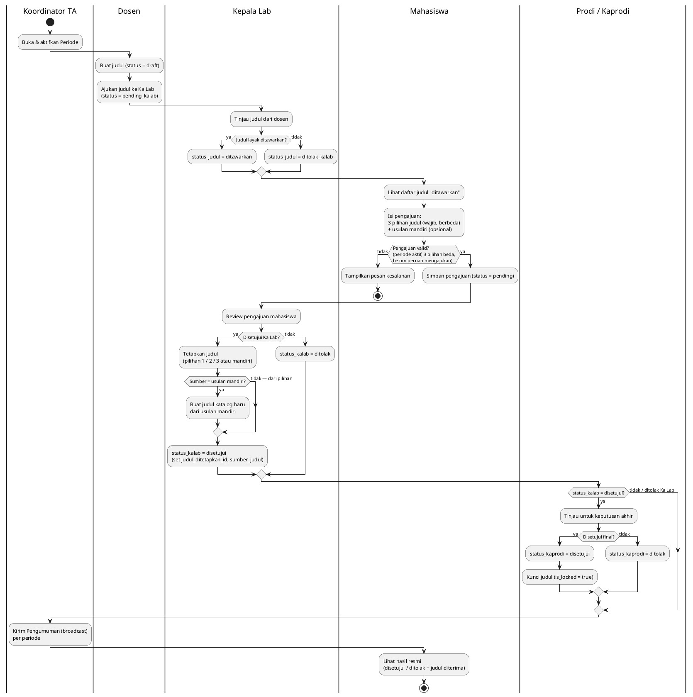
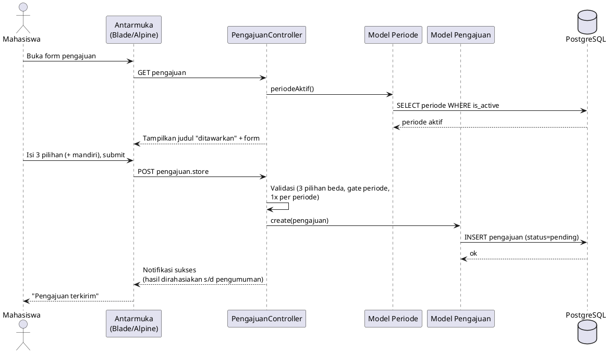
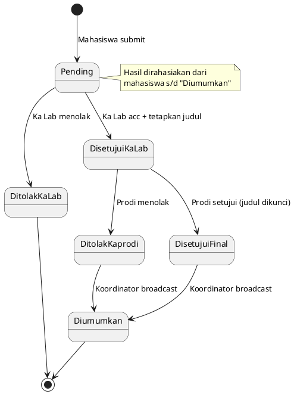

# Diagram & Metodologi (Prototyping) — Bahan Jurnal

> Pendamping [KONTEKS-PROYEK.md](KONTEKS-PROYEK.md). Berisi diagram siap-render
> (PlantUML) + uraian metode **Prototyping**. Salin ke claude.ai bersama konteks.
>
> **Cara render diagram:** tempel blok `@startuml … @enduml` ke
> https://www.plantuml.com/plantuml (atau ekstensi "PlantUML" di VS Code, atau
> minta claude.ai mengubahnya jadi gambar/Mermaid). Semua diagram di bawah sudah
> sesuai struktur kode & basis data nyata.

---

## A. Metodologi: Prototyping

### A.1 Alasan pemilihan
Metode **Prototyping** dipilih karena kebutuhan tiap peran (mahasiswa, dosen, Ka Lab,
Prodi, Koordinator TA) belum sepenuhnya terdefinisi di awal dan banyak melibatkan
**alur keputusan berjenjang** serta **aturan bisnis** yang baru jelas setelah pengguna
mencoba sistem. Prototyping memungkinkan kebutuhan disempurnakan secara iteratif
melalui purwarupa yang berulang kali dievaluasi.

### A.2 Tahapan Prototyping (model klasik)
1. **Pengumpulan kebutuhan (Listen to Customer)** — wawancara/observasi kebutuhan
   pengelolaan judul TA; identifikasi peran & alur.
2. **Perancangan & pembangunan purwarupa (Build/Revise Prototype)** — membangun
   purwarupa antarmuka + alur kerja (Laravel, Blade, PostgreSQL).
3. **Evaluasi purwarupa (Customer Test-Drive)** — pengguna mencoba; masukan dicatat;
   kembali ke tahap 2 sampai sesuai.
4. **Implementasi & pengujian akhir** — purwarupa yang disetujui dimatangkan dan diuji
   (black-box / UAT).

### A.3 Iterasi nyata yang terjadi (bukti penerapan prototyping)
Tabel ini memperlihatkan siklus purwarupa→evaluasi→perbaikan yang benar-benar
dilakukan — sangat kuat untuk bagian Metodologi/Pembahasan.

| Iterasi | Evaluasi pengguna (masukan) | Perbaikan purwarupa |
|---|---|---|
| 1 | Konsep "kuota" bimbingan ribet (perlu tambah/kurang manual) | Diganti **jumlah mahasiswa dibimbing** (dihitung otomatis) |
| 2 | Fitur chat konsultasi tak terpakai | Dihapus dari sistem |
| 3 | Aktivitas perlu terpusat per semester | **Fitur periode dimaksimalkan**: semua aktivitas dinaungi 1 periode aktif + arsip |
| 4 | Manajemen judul dosen terpecah & membingungkan | **Satu daftar** dengan penanda Tersedia/Terkunci |
| 5 | Hasil bocor sebelum pengumuman resmi | **Mekanisme anti-bocor**: hasil dirahasiakan s/d pengumuman |
| 6 | Saat ganti periode, data/kunci/notifikasi tidak konsisten | **Reset per-periode** (kunci judul dihitung ulang, notifikasi dibersihkan), riwayat tetap tersimpan |
| 7 | Dashboard kurang informatif | **Visualisasi data** (grafik) untuk dosen, Ka Lab, Prodi |
| 8 | Riwayat ambigu untuk usulan mandiri | Penanda **"judul diterima"** + sumbernya (pilihan/mandiri) |

> Narasi: tiap baris = satu siklus "purwarupa dievaluasi → diperbaiki", konsisten
> dengan sifat iteratif prototyping.

### A.4 Diagram alur metode (PlantUML)

---

## B. Use Case Diagram

**Catatan relasi penting (untuk narasi):** UC1 (ajukan) hanya bisa saat ada periode
aktif (UC10). UC7 (tetapkan judul) `<<include>>` pembuatan judul katalog bila yang
dipilih adalah usulan mandiri. Hasil baru terlihat mahasiswa setelah UC12 (pengumuman).

---

## C. Entity Relationship Diagram (ERD)

Sesuai foreign key nyata di basis data PostgreSQL. Disajikan dua tingkat:
**C.1 Konseptual** (gambar utama, bersih) dan **C.2 Fisik** (lampiran, lengkap atribut).

### C.1 ERD Konseptual (entitas + relasi)

Hanya menampilkan entitas dan relasinya — untuk gambaran besar yang mudah dibaca.

### C.2 ERD Fisik (lengkap dengan atribut & tipe)

Versi rinci untuk lampiran. Kolom timestamp bawaan (`created_at`/`updated_at`) dan
kolom legacy (`judul_id`, `prioritas`, `alasan`) sengaja tidak digambar agar ringkas.

> **Nilai enumerasi (untuk keterangan di bawah gambar):**
> `users.role` = mahasiswa | dosen | ka_lab | prodi | koordinator_ta ·
> `judul.status_judul` = draft | pending_kalab | ditawarkan | ditolak_kalab ·
> `pengajuan.status` = pending | disetujui | ditolak ·
> `pengajuan.status_kalab` / `status_kaprodi` = null (menunggu) | disetujui | ditolak ·
> `pengajuan.jenis` = pilih | mandiri ·
> `pengajuan.sumber_judul` = pilihan_1 | pilihan_2 | pilihan_3 | mandiri.
>
> **Kardinalitas:** semua relasi **1 : N**. Entitas `pengajuan` mengacu ke `judul`
> melalui 4 FK (pilihan_1/2/3 + judul_ditetapkan) — di C.1 diringkas jadi satu garis
> "dipilih / ditetapkan".

---

## D. Activity Diagram — Alur Utama Pengajuan s/d Pengumuman

---

## E. Sequence Diagram — Mahasiswa Mengajukan Judul

---

## F. Diagram State — Status Pengajuan

---

## G. Saran isi bagian "Pengujian" (Black-box)

Contoh tabel uji yang bisa langsung dipakai (lengkapi kolom Hasil):

| No | Skenario | Masukan | Hasil yang diharapkan |
|---|---|---|---|
| 1 | Pengajuan tanpa periode aktif | submit pengajuan | Ditolak: "Belum ada periode aktif" |
| 2 | Pengajuan < 3 pilihan | 2 pilihan | Validasi gagal: pilihan 3 wajib |
| 3 | Pilihan duplikat | pilihan_1 = pilihan_2 | Validasi gagal: harus berbeda |
| 4 | Pengajuan kedua di periode sama | submit lagi | Ditolak: sudah mengajukan |
| 5 | Mahasiswa lihat hasil sebelum pengumuman | buka beranda | Status "sedang diproses" (anti-bocor) |
| 6 | Ka Lab acc usulan mandiri | pilih sumber=mandiri | Judul katalog baru dibuat & ditetapkan |
| 7 | Judul sudah diambil mahasiswa lain | Ka Lab pilih judul terkunci | Ditolak: judul sudah diambil |
| 8 | Ganti periode aktif | aktifkan periode lain | Aktivitas reset, riwayat tetap ada |
| 9 | Pengumuman dikirim | broadcast | Hasil terlihat mahasiswa |

---

*Akhir dokumen diagram & metodologi.*
